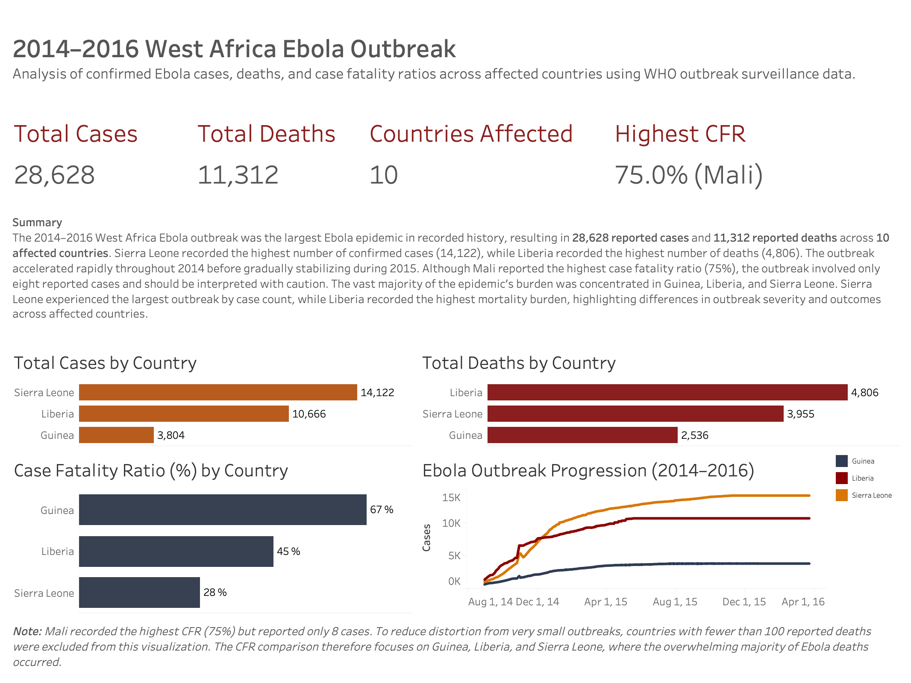

# Ebola Outbreak Analysis

Portfolio project analyzing the 2014-2016 West Africa Ebola outbreak with
Python, Jupyter notebooks, processed WHO/HDX data, and a Tableau dashboard.

## Project Objective

This project summarizes country-level Ebola cases, deaths, case fatality ratios,
and outbreak progression to show how the outbreak burden varied across affected
countries.

The analysis is descriptive. It does not claim that dashboard or notebook trends prove intervention effects.

## Dataset

Primary source: [WHO / HDX Ebola Cases and Deaths Dataset](https://data.humdata.org/dataset/ebola-cases-2014)

Public processed datasets:

- `datasets/processed/master_cases_deaths.csv`
- `datasets/processed/tableau_dashboard_data.csv`
- `datasets/processed/tableau_timeseries_top3.csv`
- `datasets/processed/tableau_kpi_data.csv`

The project uses cumulative confirmed, probable, and suspected Ebola cases and
deaths. Minor differences may exist between the WHO/HDX dataset and later
retrospective totals, so the processed WHO/HDX-derived dataset is used as the
analytical source of record.

## Methodology

1. Selected cumulative confirmed, probable, and suspected case and death indicators.
2. Combined cases and deaths at the country-date grain.
3. Excluded `Liberia 2` and `Guinea 2` because merging them into the main
   country series creates duplicate country-date rows.
4. Calculated final country totals, CFR, top-three time series, and Tableau-ready KPI files.
5. Built a Tableau dashboard from the processed dashboard datasets.

More detail is available in `docs/methodology.md`.

## Key Findings

- The cleaned project dataset contains 28,628 reported cases and 11,312 reported deaths across 10 affected countries.
- Sierra Leone recorded the highest number of reported cases: 14,122.
- Liberia recorded the highest number of reported deaths: 4,806.
- Guinea, Liberia, and Sierra Leone accounted for the overwhelming majority of reported cases and deaths.
- Mali recorded the highest CFR at 75%, but this was based on only 8 reported
  cases and should be interpreted cautiously.
- The dashboard CFR comparison focuses on countries with at least 100 reported
  deaths to reduce distortion from very small outbreaks.

## Interactive Dashboard

[View Dashboard on Tableau Public](https://public.tableau.com/app/profile/loremipsumxo/viz/ebola_2014_outbreak/Dashboard1)



## Project Structure

```text
datasets/
  processed/           Cleaned analysis data and Tableau-ready CSV files

docs/
  methodology.md

exports/
  dashboards/          Final Tableau dashboard PNG export

notebooks/
  01_dataset_exploration.ipynb
  02_ebola_outbreak_analysis.ipynb

references/
  source_registry.md

requirements.txt
.gitignore
```

## Tools Used

- Python
- pandas
- Jupyter Notebook
- Tableau
- Markdown

## Reproducibility

Install dependencies:

```bash
pip install -r requirements.txt
```

Main notebooks:

- `notebooks/02_ebola_outbreak_analysis.ipynb` is the final rendered analysis notebook.
- `notebooks/01_dataset_exploration.ipynb` documents raw-data exploration and requires the original WHO/HDX raw CSV locally.

The public repository includes processed datasets used by the final notebook and
dashboard. The original raw WHO/HDX file is excluded from the public repo;
download it from HDX if you want to rerun raw-data exploration from scratch.

## Limitations

- Counts include confirmed, probable, and suspected cases/deaths, not confirmed-only totals.
- WHO/HDX totals may differ from later retrospective reports due to revisions,
  reclassification, reporting delays, and source changes.
- `Liberia 2` and `Guinea 2` are excluded to preserve one row per country-date.
- CFR values for very small outbreaks are unstable descriptive ratios.
- Dashboard and notebook visuals are descriptive and do not establish causality.

## Author

GitHub: [loremipsumxo](https://github.com/loremipsumxo)
